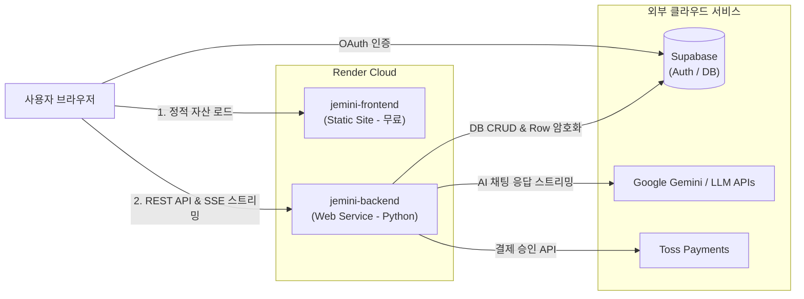

# 🚀 Jemini 풀스택 프로젝트 Render 배포 가이드

이 문서는 **Jemini Chatbot (FastAPI 백엔드 + React/Vite 프론트엔드 + Supabase + Toss Payments)** 프로젝트를 [Render(https://render.com)](https://render.com/)에 배포하고 운영하기 위한 단계별 안내서입니다.

---

## 📌 목차
1. [아키텍처 및 배포 방식](#1-아키텍처-및-배포-방식)
2. [사전 준비 사항](#2-사전-준비-사항)
3. [방법 1: Render Blueprint(render.yaml)를 통한 원클릭 배포 (권장)](#3-방법-1-render-blueprintrenderyaml를-통한-원클릭-배포-권장)
4. [방법 2: Render 대시보드 수동 배포](#4-방법-2-render-대시보드-수동-배포)
5. [배포 후 외부 서비스 연동 설정 (필수)](#5-배포-후-외부-서비스-연동-설정-필수)
6. [환경 변수(Environment Variables) 총정리](#6-환경-변수environment-variables-총정리)
7. [정상 동작 검증 체크리스트](#7-정상-동작-검증-체크리스트)
8. [자주 묻는 질문 및 트러블슈팅 (FAQ)](#8-자주-묻는-질문-및-트러블슈팅-faq)

---

## 1. 아키텍처 및 배포 방식

- **Frontend (`Static Site`)**: Render에서 무료로 호스팅되며, 고성능 CDN을 통해 서빙됩니다.
- **Backend (`Web Service`)**: FastAPI 애플리케이션으로 동작하며, SSE(Server-Sent Events) 스트리밍 및 비즈니스 로직을 처리합니다.

---

## 2. 사전 준비 사항

1. **GitHub 저장소 푸시**:
   - 현재 프로젝트 루트 디렉터리가 GitHub 원격 저장소에 푸시되어 있어야 합니다.
2. **Supabase 프로젝트 정보**:
   - Supabase Project URL (`https://xxxx.supabase.co`)
   - Supabase Secret Key 또는 Anon Key
3. **Google Gemini API Key**:
   - [Google AI Studio](https://aistudio.google.com/)에서 발급받은 API 키
4. **AES-256 데이터 암호화 키 (`CHAT_ENCRYPTION_KEY`)**:
   - 32바이트 길이의 Base64 인코딩 문자열 (로컬 `.env`에서 사용 중인 키 사용)
5. **토스페이먼츠 키 (선택/테스트)**:
   - 클라이언트 키: `test_ck_...`
   - 시크릿 키: `test_sk_...`

---

## 3. 방법 1: Render Blueprint(`render.yaml`)를 통한 원클릭 배포 (권장)

저장소 루트에 포함된 `render.yaml` 파일을 사용하여 백엔드와 프론트엔드를 한 번에 구성합니다.

1. [Render 대시보드](https://dashboard.render.com/)에 로그인합니다.
2. 우측 상단 **`New +`** 버튼 클릭 ➡️ **`Blueprint`** 선택
3. Jemini 프로젝트가 포함된 **GitHub 저장소 연결**
4. Render가 `render.yaml`을 자동으로 감지하고 생성할 서비스 목록을 표시합니다:
   - `jemini-backend` (Web Service)
   - `jemini-frontend` (Static Site)
5. 화면에 표시되는 **환경 변수(Environment Variables)** 입력란에 실제 키 값을 입력합니다:
   - `SUPABASE_URL`
   - `SUPABASE_KEY`
   - `CHAT_ENCRYPTION_KEY`
   - `GEMINI_API_KEY`
   - `TOSS_SECRET_KEY`
   - `VITE_SUPABASE_URL`
   - `VITE_SUPABASE_PUBLISHABLE_KEY`
6. **`Apply`** 버튼을 클릭하면 두 서비스가 자동으로 빌드 및 배포됩니다.

---

## 4. 방법 2: Render 대시보드 수동 배포

### Step 4-1. Backend 배포 (Web Service)
1. Render 대시보드 ➡️ **`New +`** ➡️ **`Web Service`** 선택
2. 저장소 선택 후 아래 정보 입력:
   - **Name**: `jemini-backend`
   - **Region**: `Singapore` (권장)
   - **Branch**: `main`
   - **Root Directory**: `backend`
   - **Runtime**: `Python 3`
   - **Build Command**: `pip install -r requirements.txt`
   - **Start Command**: `python -m uvicorn main:app --host 0.0.0.0 --port $PORT`
   - **Plan Type**: `Free`
3. **Advanced** ➡️ **Environment Variables**에 다음 키-값 추가:
   - `PYTHON_VERSION`: `3.10.14`
   - `SUPABASE_URL`: `https://your-project.supabase.co`
   - `SUPABASE_KEY`: `your-supabase-key`
   - `CHAT_ENCRYPTION_KEY`: `your-32byte-base64-key`
   - `GEMINI_API_KEY`: `your-gemini-api-key`
   - `TOSS_SECRET_KEY`: `test_sk_...`
4. **`Create Web Service`** 클릭 후 배포 완료 시 생성된 백엔드 URL 확인 (예: `https://jemini-backend.onrender.com`)

### Step 4-2. Frontend 배포 (Static Site)
1. Render 대시보드 ➡️ **`New +`** ➡️ **`Static Site`** 선택
2. 저장소 선택 후 아래 정보 입력:
   - **Name**: `jemini-frontend`
   - **Branch**: `main`
   - **Root Directory**: `frontend`
   - **Build Command**: `npm install && npm run build`
   - **Publish Directory**: `dist`
3. **Advanced** ➡️ **Environment Variables** 추가:
   - `VITE_API_BASE_URL`: `https://jemini-backend.onrender.com` *(Step 4-1에서 생성된 백엔드 URL)*
   - `VITE_SUPABASE_URL`: `https://your-project.supabase.co`
   - `VITE_SUPABASE_PUBLISHABLE_KEY`: `your-supabase-anon-key`
   - `VITE_TOSS_CLIENT_KEY`: `test_ck_your_client_key_here`
4. **`Create Static Site`** 클릭하여 배포 진행
5. 배포 완료 후 좌측 메뉴 **`Redirects/Rewrites`**로 이동하여 SPA 라우팅 규칙 추가:
   - **Source**: `/*`
   - **Destination**: `/index.html`
   - **Action**: `Rewrite`

---

## 5. 배포 후 외부 서비스 연동 설정 (필수)

### 1) Supabase Auth 리다이렉트 URL 등록
소셜 로그인(Google OAuth) 및 매직 링크 인증이 정상 작동하려면 Supabase에 배포된 프론트엔드 도메인을 등록해야 합니다.

1. [Supabase 대시보드](https://supabase.com/dashboard) ➡️ 프로젝트 선택
2. 좌측 메뉴 **`Authentication`** ➡️ **`URL Configuration`** 이동
3. **Site URL**: `https://jemini-frontend.onrender.com` 입력
4. **Redirect URLs**에 다음 항목 추가 후 저장:
   - `https://jemini-frontend.onrender.com/**`
   - `http://localhost:3000/**` (로컬 개발용)

### 2) 토스페이먼츠(Toss Payments) 연동 확인
- `frontend/src/features/payment/ui/PaymentModal.tsx`의 결제 성공/실패 URL이 `window.location.origin`을 기준으로 동작하므로, 배포된 도메인(`https://jemini-frontend.onrender.com`)으로 자동 처리됩니다.

---

## 6. 환경 변수(Environment Variables) 총정리

### 🖥️ Backend (Web Service)
| 변수명 | 필수 여부 | 설명 |
|---|---|---|
| `PYTHON_VERSION` | 권장 | Python 버전 (`3.10.14` 이상) |
| `SUPABASE_URL` | **필수** | Supabase 프로젝트 URL |
| `SUPABASE_KEY` | **필수** | Supabase Secret Key 또는 Anon Key |
| `CHAT_ENCRYPTION_KEY` | **필수** | AES-256 GCM 32바이트 암호화 키 (Base64) |
| `GEMINI_API_KEY` | **필수** | Google Gemini API Key |
| `TOSS_SECRET_KEY` | 선택 | 토스페이먼츠 시크릿 키 (`test_sk_...`) |
| `OPENAI_API_KEY` | 선택 | Multi-Vendor 확장 시 OpenAI API 키 |
| `ANTHROPIC_API_KEY` | 선택 | Multi-Vendor 확장 시 Anthropic API 키 |

### 🌐 Frontend (Static Site)
| 변수명 | 필수 여부 | 설명 |
|---|---|---|
| `VITE_API_BASE_URL` | **필수** | 배포된 백엔드 서비스의 URL (예: `https://jemini-backend.onrender.com`) |
| `VITE_SUPABASE_URL` | **필수** | Supabase 프로젝트 URL |
| `VITE_SUPABASE_PUBLISHABLE_KEY` | **필수** | Supabase Anon / Publishable Key |
| `VITE_TOSS_CLIENT_KEY` | 선택 | 토스페이먼츠 클라이언트 키 (`test_ck_...`) |

---

## 7. 정상 동작 검증 체크리스트

배포 완료 후 아래 순서대로 동작을 검증합니다:

- [ ] **백엔드 헬스체크**: 브라우저에서 `https://jemini-backend.onrender.com/` 접속 시 `{"message": "Jemini Chatbot API is running...", "status": "ok"}` JSON 응답 확인
- [ ] **프론트엔드 접속**: `https://jemini-frontend.onrender.com/` 접속 시 Jemini UI 정상 렌더링 확인
- [ ] **Google 로그인**: 헤더 우측 로그인 버튼을 통해 Supabase Auth 정상 인증 확인
- [ ] **실시간 AI 채팅**: 메시지 전송 시 SSE 스트리밍으로 텍스트가 실시간 타이핑되는지 확인
- [ ] **채팅 세션 저장 및 조회**: 사이드바에 새로운 채팅 목록이 저장되고 새로고침 후에도 복원되는지 확인
- [ ] **토스페이먼츠 결제창**: 요금제 모달에서 결제창 호출 및 테스트 결제 완료 확인

---

## 8. 자주 묻는 질문 및 트러블슈팅 (FAQ)

### Q1. 무료 인스턴스에서 첫 요청이 너무 느립니다 (Cold Start).
> **원인**: Render Free 티어의 Web Service는 15분간 요청이 없으면 슬립(Spin down) 상태가 됩니다.  
> **해결**: 슬립 상태에서 첫 요청이 들어오면 약 30~50초의 부팅 시간이 발생합니다. 이후에는 즉시 응답하며, 상용 서비스 배포 시 Starter 플랜($7/월) 이상으로 업그레이드하면 슬립 없이 상시 가동됩니다.

### Q2. AI 스트리밍 응답이 중간에 끊기거나 실시간으로 안 나옵니다.
> **해결**: 본 프로젝트는 프론트엔드가 백엔드 URL로 직접 연결(`VITE_API_BASE_URL`)하도록 구성되어 있어 프록시 버퍼링 없이 원활하게 스트리밍됩니다. 백엔드의 CORS 설정(`allow_origins=["*"]`)이 정상 적용되어 있는지 확인하십시오.

### Q3. 프론트엔드에서 환경 변수를 수정했는데 화면에 반영되지 않습니다.
> **원인**: Vite 정적 사이트(`Static Site`)는 **빌드 시점(Build time)**에 `VITE_` 환경 변수가 번들에 주입됩니다.  
> **해결**: Render 대시보드에서 환경 변수를 수정한 후 반드시 **`Manual Deploy` ➡️ `Clear build cache & deploy`**를 실행해 재빌드해야 합니다.
